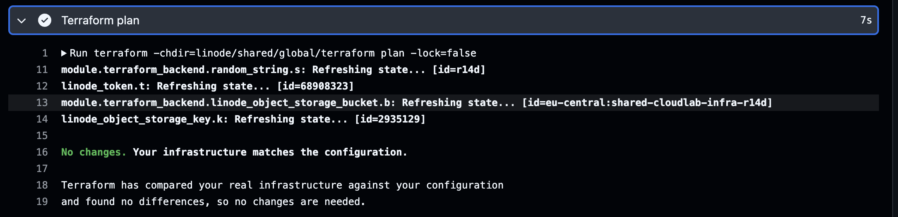

# Terraform Infrastructure

Terraform deployment repository template

## Usage

```sh
OWNER=...
SERVICE=...
gh repo create ${OWNER}/${SERVICE}-infra --template zuse-cc/terraform-infra-template --private
git clone git@github.com:${OWNER}/${SERVICE}-infra
```

## Prerequisites

- Terraform needs to be installed
- A valid `LINODE_TOKEN` to do the initial setup locally

## Setup

- One time setup to install dependencies:

```sh
make venv
```

- Edit [linode/shared/global/terraform/terraform.tfvars](./linode/shared/global/terraform/terraform.tfvars), set `label`
- Apply backend configuration:

```sh
terraform -chdir=linode/shared/global/terraform init
terraform -chdir=linode/shared/global/terraform apply
```

- Uncomment the backend config in `linode/shared/global/terraform/backend.tf`
- Obtain the bucket name we just created:

```sh
export AWS_ACCESS_KEY_ID=$(terraform -chdir=linode/shared/global/terraform output -raw tfstate_access_key_id)
export AWS_SECRET_ACCESS_KEY=$(terraform -chdir=linode/shared/global/terraform output -raw tfstate_secret_access_key)

terraform -chdir=linode/shared/global/terraform output -raw bucket; echo
```

- Replace the bucket name with the bucket we just created (see Terraform outputs)
- Migrate the local state to the remote backend:

```sh
terraform -chdir=linode/shared/global/terraform init -migrate-state
```

- Don't forget to delete the local state file and all backups, they contain sensitive credentials!

```sh
rm linode/shared/global/terraform/*tfstate*
```

- Set `TF_STATE_BUCKET` in `generate.py` to the bucket just created
- See [this runbook](./docs/runbooks/github-secrets.md) to set up required secrets in GHA
- Once all secrets are set up, push the initial branch and create a new pull request
- Workflow should run `terraform plan` in `linode/shared/global/terraform` and report no changes



## Generators

- To generate a generic workspace config:

```sh
./generate.py workspace --name foo
```

- To preview what would be generated, pass `--dry-run`

```sh
./generate.py --debug --dry-run workspace --name foo
```
